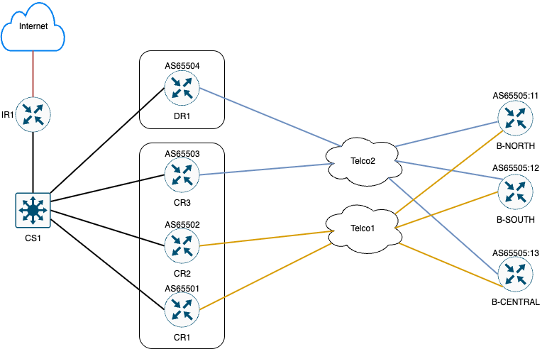

# OCSNE BGP/OSPF Lab

This lab provides sample Cisco router configuration files for practicing BGP and OSPF routing protocols. Each file contains configuration snippets for different routers and scenarios.

## Folder Structure

- `b1-north.txt`  — Configuration for North Branch Router 1
- `b2-south.txt`  — Configuration for South Branch Router 2
- `b3-central.txt` — Configuration for Central Branch Router 3
- `cr1.txt`, `cr2.txt`, `cr3.txt` — Core Router configurations
- `cs1.txt` — Cisco Switch configuration
- `dr1.txt` — Disaster Recovery Router configuration
- `ir1.txt` — Internet Router configuration
- `telco1.txt`, `telco2.txt` — Telco Router configurations

## Usage

1. Review each configuration file for interface, routing, and protocol settings.
2. Apply configurations to your Cisco devices in a lab environment.
3. Use these files to simulate BGP and OSPF scenarios, troubleshoot, and learn.

## Notes

- All configuration files are in plain text and follow Cisco IOS syntax.
- This lab is for educational purposes only.

## License

See `LICENSE` for details.
